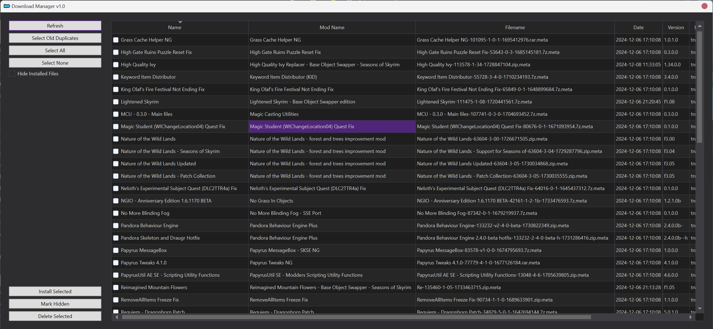
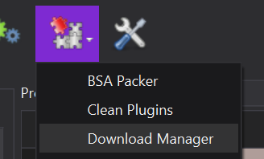

# MO2 Download Manager+



## What It Does

Adds a few new features to manage downloads within MO2 for hoarders like me.
Features include:

- Batch installation of mods
- Batch deletion of downloads
    - Custom auto-selection of duplicates, keeping the latest of each downloaded mod but removing old versions
- Batch removal of mods from the download list within MO2
- TBD...........

## Installing

Download the zip archive here or on [GitHub](https://github.com/aglowinthefield/mo2-download-manager/releases/) (I wrote this README for Nexus haha)

Extract into the root of your MO2 install.

## Using



Click the plugins icon in the MO2 toolbar and launch with Download Manager.

**NOTE** Because 'refresh' is possibly pretty expensive if you have 100s
of GBs of downloads, it does not run on launch by default.
Hit refresh once when the window opens :)

## Feedback

Hit me up on GitHub or Nexus for issues. I'm an experienced dev
but unfortunately not with PyQt or C++, so any suggestions are
more than welcome. I made this for my own sanity and hope it's
useful for you too. Part of an upcoming suite of MO2 plugins and
improvements once I get my sea-legs with C++ and CMake.

## Building/Contributing

Set up `venv` however you'd like. I have mine in the root of the project and 
use `pyenv` to manage Python versions. I build against 3.12.

You should not have to do any `pip install`. We only use MO2 libraries with one caveat:

I'm using PyCharm to enable remote debugging through MO2.
Pretty neat stuff. However you cannot import libraries into MO2 plugins
without having their files explicitly in the project dir, which is why we have
these lines in __init__.py

```python
lib_dir = os.path.join(os.path.dirname(__file__), "libs")
sys.path.append(lib_dir)
```

Follow the instructions in the `Python Debug Server` section of PyCharm run configurations if you want to use this functionality.
It'll just silently move along without it.
